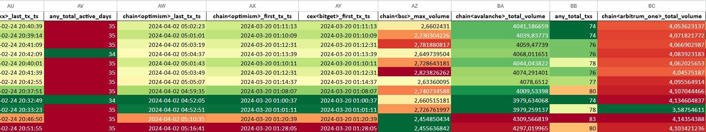
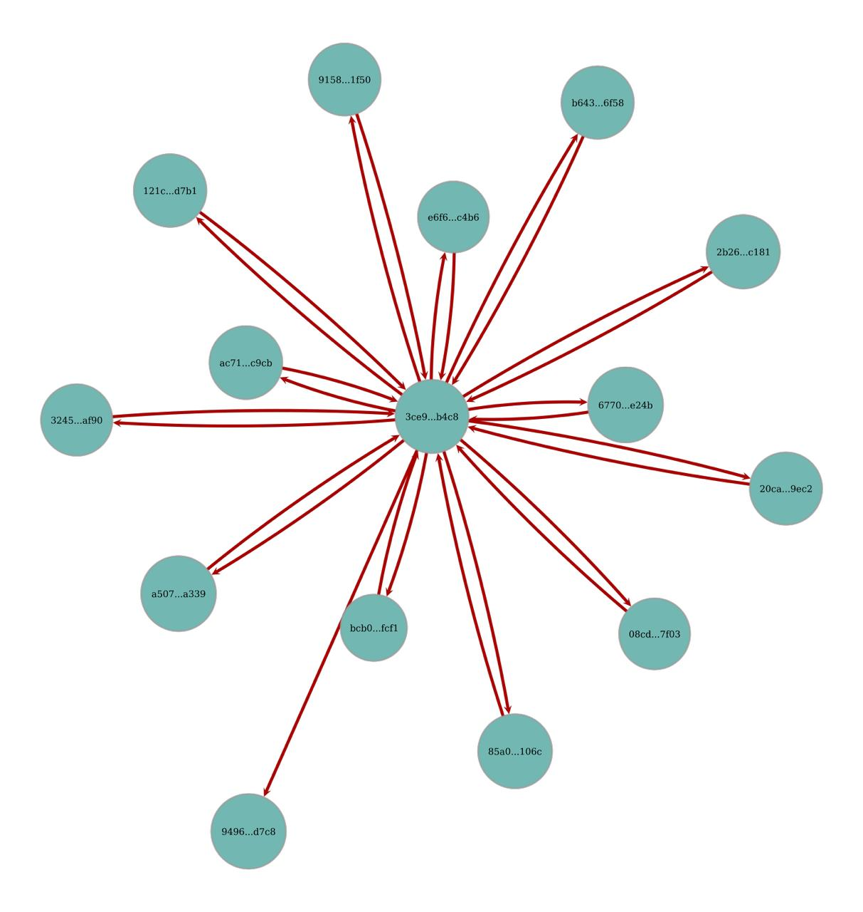

# Sybil Detection Showcase

This repository showcases examples of our Sybil detection work and analysis results. Here you can see the outcomes of our detection methods applied to blockchain data.

## Overview

Our analysis identifies suspicious patterns and clusters of addresses that exhibit Sybil behavior across multiple blockchain networks. The detection process involves several stages, each revealing different types of coordinated activity.

- **Graph Analysis**: Identifies interconnected networks of addresses with suspicious transaction patterns
- **Cluster Analysis**: Groups addresses with similar behavioral characteristics
- **Pattern Recognition**: Detects coordinated activities and timing anomalies

### Cluster Analysis Table

Example table for checking clusters with random wallets

https://docs.google.com/spreadsheets/d/1x9SZQ8ZEW0U2a6mAHSR4E5aU6JLduX7t/edit?usp=sharing&ouid=115398103641496771725&rtpof=true&sd=true

### Network Graph

Example of a graph used to analyze connection logic:

### Sybil Detection Summary
How our final results table looks in a completed repository:

| Analysis Stage            |  Total Addresses |  Total Points        | % of All Addresses | % of All Points |
|--------------------------|--------------------|------------------------|--------------------|-----------------|
| PREVIOUS_SYBILS      | 113                | 9,879,058,667          | 0.226%             | 0.165%          |
| GRAPH_ANALYSIS_PART_1| 922                | 84,743,926,622         | 1.84%              | 1.41%           |
| GRAPH_ANALYSIS_PART_2| 586                | 16,928,731,487         | 1.17%              | 0.28%           |
| CLUSTER_ANALYSIS     | 6,350              | 5,769,054,327          | 12.70%             | 0.10%           |
| ARMA_CLUSTER_ANALYSIS| 3,911              | 128,388,782            | 7.82%              | 0.002%          |
|  **TOTAL**              | **11,882**         | **117,449,159,885**    | **23.764%**        | **1.957%**      |
